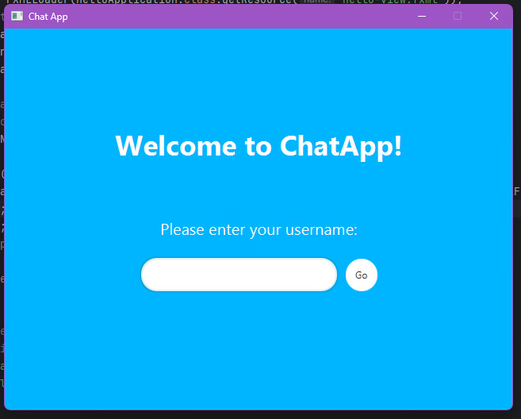
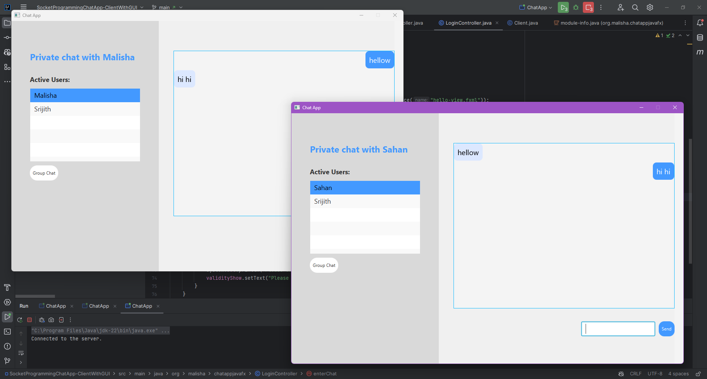
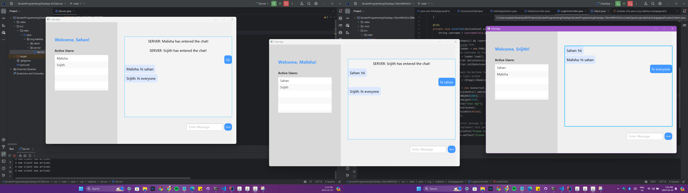

# ChatApp using Socket Programming (Java)

This repository contains a chat application with a GUI for exchanging text messages between multiple computers over the internet. 
As a group Project of the University, we developed for Networking Programming module during the 6th Semester.
The application is built using Java socket programming and JavaFX. 
Users can connect to a chat server with a unique username and see who is online in the same chat room. 
This application includes separate server and client components, and also the server is already hosted on an Amazon AWS EC2 cloud server or you can use it locally using localhost

## About Socket Programming

Socket programming is a way of connecting two nodes on a network to communicate with each other. 
One socket(node) listens on a particular port at an IP, while another socket reaches out to the other to form a connection. 
The server forms the listener socket while the client reaches out to the server.

## UI

### Login


### Private Chat 


### Group Chat


## Features

- GUI-based chat application using JavaFX.
- Server-client architecture.
- Unique username enforcement to avoid confusion.
- Real-time message broadcasting to all connected clients.
- Active user list display.
- Server hosted on AWS EC2 for better availability and scalability.


## Getting Started

### Prerequisites

- Java Development Kit (JDK) 21 or higher.
- JavaFX SDK.

 ### Running the Server

The server component is hosted on an AWS EC2 cloud server. To run your own server instance, follow these steps:

1. **Launch an AWS EC2 Instance**:
   - Create an EC2 instance with your preferred specifications.
   - Ensure the security group allows inbound connections on the desired port (default: 12345).

2. **Deploy ChatServer on EC2**:
   - SSH into your EC2 instance.
   - Clone this repository.
   - Navigate to the server directory and compile the server code:
     ```sh
     javac Server.java
     ```
   - Run the server:
     ```sh
     java Server
     ```

### Running the Client

1. **Clone this Repository**:
   ```sh
   git clone https://github.com/sahanrashmikaslk/SocketProgrammingChatApp.git
   ```
   
2. **Navigate to the Client Directory**:
   ```sh
   cd SocketProgrammingChatApp-ClientWithGUI
   ```
   
3. **Run the ChatApp**
  

4. **Connect to the Server**:
   - Enter your unique username.

        
## How to Use

 - In order to connect to the client-server and communicate with other clients, the server program must be run at first on YOUR SERVER ( like Google Cloud, Azure, Amazon AWS). 
 - Before the server program runs, you need to arrange the port that the client will connect. 
 - You can find it on the ```server.java``` class in the ```SocketProgrammingChatApp-EC2Server``` folder. 
 - Then you need to set the connection address on the database class in the ```SocketProgrammingChatApp-ClientWithGUI``` folder according to your database. For login.
 - Then you need to change the IP and port number (at line 98) that you will connect with the socket in the ```HelloController.java``` class in the same folder. 
 - After setting up all of these, you can run the server program on the server and then open the client on the device you want and chat with the people around you.


## Application Logic

### Server

1. **Initialization**
   - The server waits for client connection requests.
   - For each new connection, a unique socket and thread are created for communication.

2. **Username Handling**
   - The server verifies that the username is unique.
   - If the username is accepted, it adds the user to the active user list and notifies all clients.
   - If the username is rejected, the client must enter a new one.

3. **Group Messages Broadcasting**
   - The server receives messages from clients and broadcasts them to all connected users.
   - When a client disconnects, the server updates the active user list and notifies the remaining users.

4. **Private Messages**
   -  The server handles private messages between specific users.
   -  When a private message is received, it is sent only to the intended recipient.
     
### Client

1. **Connecting**:
   - The client sends the username to the server for validation.
   - Once validated, the client receives the active user list and can start chatting.

2. **Messaging**:
   - Users compose messages in a multiline text area.

3. **Disconnecting**:
   - Users can exit the chat by closing the application, which notifies the server to update the user list.

## User Interface

### Client Interface

- **Username Input**: Text field for entering the username.
- **Compose Message**: Text area for composing messages.
- **Send Message**: Button to send the composed message.
- **Active Users**: List view displaying currently connected users.
  
### Server Interface

- **Activity Log**: List view showing server activities and user connections.
- **Active Users**: List view showing currently connected users.

## Conclusion

 - This Chat Application provides a simple yet effective way to communicate in real-time over the network with a user-friendly GUI. 
 - Leveraging AWS EC2 for the server component ensures better availability and scalability for all connected users.

## Contributors

- Sahan Lelwala
- Dushmin Malisha
- Srijith Yaparathna

